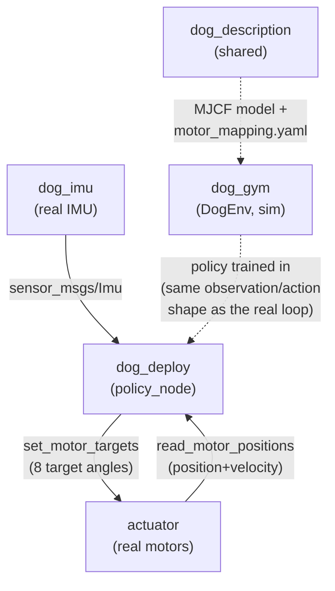

# metal-quadruped

An 8-DOF quadruped (thigh + calf per leg, no hip motors) driven by 8x
Unitree GO-M8010-6 motors, controlled from a Jetson.

**Goal:** train an RL policy (MuJoCo + Gymnasium + PPO) that makes the
robot walk and run, deploy it on the Jetson, and iterate between
simulation and real hardware until it performs well in both.

## Packages

| Package | Purpose |
|---|---|
| [`actuator`](actuator/README.md) | ROS 2 node driving the 8 real motors over RS485 (services: velocity/position control, homing, batch position targets). |
| [`dog_imu`](dog_imu/README.md) | Driver node for the LSM6DSO32 IMU on the Jetson; publishes `sensor_msgs/Imu`. |
| [`dog_description`](dog_description/README.md) | The MuJoCo model and the canonical motor-to-joint/sign mapping shared by sim and real code. |
| [`dog_gym`](dog_gym/README.md) | Gymnasium sim environment + PPO training/export pipeline. |
| [`dog_deploy`](dog_deploy/README.md) | Sim-to-real bridge: runs a trained, exported policy against the real robot on the Jetson. |

## Data flow




`dog_description/config/motor_mapping.yaml` is the single source of truth
for motor-id-to-joint ordering and sign, loaded by both `dog_gym` and
`dog_deploy` — see that package's README for exactly what it encodes.

## Building

```bash
cd dog_ros2_ws
colcon build
source install/setup.bash
```

`dog_gym` needs extra, heavy, non-rosdep dependencies (`mujoco`, `torch`,
`stable_baselines3`) — see `dog_gym/README.md` for a `--system-site-packages`
venv setup that doesn't fight ROS's own Python packages. `dog_deploy` needs
`torch` on the Jetson at inference time only.

## Acknowledgments / where this came from

The RL/sim pieces (`dog_description`, `dog_gym`) started from a teammate's
reference project, [`shane_ws` — Quadruped design and improved gaits](https://sdalal1.github.io/projects/Quadruped-design-and-Improved-gaits/):
an 8-DOF, thigh+calf, no-hip MuJoCo cheetah model and a PPO/Stable-Baselines3
training pipeline. They were rewritten on the modern `mujoco` Python bindings
+ current Gymnasium API rather than ported as-is (the reference project used
the deprecated `mujoco_py`). See `dog_gym/README.md` and
`dog_description/README.md` for what changed and why.

Some reward-shaping and gait-structuring ideas in `dog_gym`'s walking
environment were informed by [`saifs_ws` — go2-sim2real-locomotion-rl](https://github.com/saifahmadgit/go2-sim2real-locomotion-rl/blob/main/examples/locomotion/final/go2_env_walk.py).
